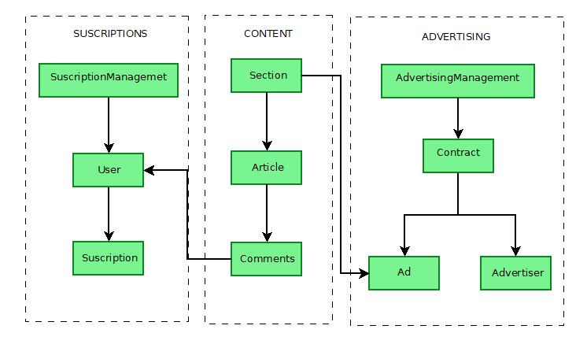
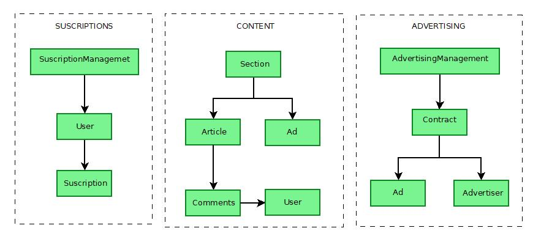

# ddd-example-online-newspaper-domain
This is a simple exercise for practising DDD modeling. It is about an online newspaper model.

(In progres...)

First, I have considered this entities model with its relationships:
 

It can be seen three different unbounded context:
 

To grant the real independence all context, it is needed consider a different User class in the Content context and Payments context. This is not a duplicate code case because these classes actually are differents. In the Content context, a User is any person who are reading the newspaper and wants comment while in the Payments context a User is a client who are paying every month. Thus the needed information is different in each case
Same case occurs with Ad class and the context Content and Advertising.
 

